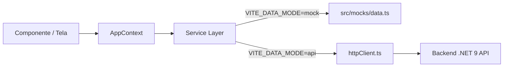

# Arquitetura do NinhoApp

Este documento consolida a arquitetura técnica, convenções de código, fluxo de dados e organização estrutural do **Ninho** (`home-manager-app`). Ele serve como fonte de verdade para desenvolvedores humanos e agentes de IA.

---

## 1. Visão Geral do Sistema

O **Ninho** é um Progressive Web App (PWA) em português brasileiro voltado à organização e gestão doméstica familiar compartilhada:
- **Dashboard**: Visão geral diária, avisos do mural, previsão do tempo local e atalhos rápidos.
- **Tarefas (`/tasks`)**: Gestão de afazeres domésticos com prioridades, responsáveis, prazos e categorias.
- **Lista de Compras (`/shopping`)**: Gestão colaborativa de compras, itens por categoria, modo compra rápida e sincronização em tempo real via SignalR.
- **Financeiro (`/financial`)**: Lançamento de despesas e receitas, contas bancárias (`/financial/account`), cartões de crédito (`/financial/card`), metas (`/financial/goals`) e recorrências (`/financial/recurrences`).
- **Agenda (`/calendar`)**: Calendário doméstico e compromissos do lar.
- **Ninhos Familiares**: Gestão de múltiplos espaços/residências, permissões de membros (Owner, Admin, Member, Child) e convites via link (`/invite`).

---

## 2. Estrutura de Diretórios

O projeto adota uma estrutura limpa, modular e **100% em TypeScript**:

```
home-manager-app/
├── docs/                    # Documentação técnica e design system
│   ├── api.json             # Contrato de referência OpenAPI da API backend
│   ├── ARCHITECTURE.md      # Este documento de arquitetura
│   ├── AGENT.md             # Guia de documentação para IAs
│   ├── DESIGN.md            # Rationale visual "Domestic Sanctuary" e regras de UI
│   ├── ENVIRONMENTS.md      # Variáveis de ambiente (dev, staging, prod)
│   ├── DEPLOY.md            # Guias de deploy (Vercel, Docker)
│   └── ROADMAP.md           # Marcos alcançados e planejamento futuro
├── public/
│   ├── icons/               # Ícones PWA e ícones 3D (clay/)
│   ├── favicon.svg
│   ├── logo.svg
│   ├── manifest.json
│   └── sw.js
├── scripts/                 # Scripts utilitários de build e geração
│   └── generate-icons.js    # Gerador de ícones PWA via Sharp
├── src/
│   ├── components/          # Componentes visuais da interface
│   │   ├── app-sidebar.tsx  # Sidebar responsiva principal com navegação
│   │   ├── common/          # Componentes reutilizáveis e transversais
│   │   ├── modals/          # Diálogos, sheets e formulários modais
│   │   ├── modules/         # Páginas dos módulos de negócio
│   │   │   ├── dashboard/   # Subcomponentes do Dashboard
│   │   │   ├── dashboard-v2/# Protótipo experimental V2 (em teste)
│   │   │   ├── financial/   # Módulo financeiro e subpáginas
│   │   │   ├── financial-v2/# Protótipo experimental V2 (em teste)
│   │   │   ├── shopping/    # Lista de compras e hooks
│   │   │   ├── tasks/       # Lista de tarefas e kanban
│   │   │   ├── Calendar.tsx
│   │   │   ├── Dashboard.tsx
│   │   │   ├── Financial.tsx
│   │   │   └── Tasks.tsx
│   │   ├── onboarding/      # Tour guiado (SpotlightTour) e boas-vindas
│   │   ├── profile/         # Painéis e modais de perfil de usuário
│   │   ├── settings/        # Painéis de configurações do app
│   │   ├── skeletons/       # Loading skeletons por módulo
│   │   └── ui/              # Componentes primitivos Radix UI + Tailwind
│   ├── constants/           # Constantes estáticas e avatares (Koboyo)
│   ├── contexts/            # Contextos React (Global State)
│   ├── hooks/               # Custom hooks reutilizáveis (SignalR, Toast, etc.)
│   ├── lib/                 # Utilitários de baixo nível e animações
│   ├── mocks/               # Dados fictícios para desenvolvimento offline
│   ├── pages/               # Páginas de autenticação e rotas públicas
│   ├── schemas/             # Validação e schemas Zod (Layer 1 - API Contracts)
│   ├── services/            # Serviços de comunicação e HTTP (Dual-Mode)
│   ├── types/               # Tipos TypeScript do domínio do frontend (Layer 2)
│   ├── utils/               # Formatadores e cálculos de negócio
│   ├── App.tsx              # Componente raiz e árvore de rotas
│   ├── index.css            # Estilos globais e tokens de tema CSS
│   └── main.tsx             # Ponto de entrada do React
├── tailwind.config.ts       # Configuração do Tailwind CSS
├── tsconfig.json            # Configuração do compilador TypeScript
└── vite.config.ts           # Configuração do bundler Vite
```

---

## 3. Fluxo de Dados e Camada de Serviços (Dual-Mode)

Todo o acesso a dados na aplicação obedece estritamente ao padrão **Dual-Mode** implementado em `src/services/`:



- **Mock Mode (`VITE_DATA_MODE=mock`)**: Retorna dados de `src/mocks/data.ts` simulando latência de rede (100ms). Permite desenvolvimento visual ágil sem backend ativo.
- **API Mode (`VITE_DATA_MODE=api`)**: Executa requisições HTTP autenticadas via cookies contra `http://localhost:5026` (ou URL configurada).
- **HTTP Client unificado (`src/services/api/httpClient.ts`)**:
  - Autenticação baseada em cookie (`credentials: 'include'`).
  - Refresh automático de token no retorno de `401 Unauthorized` através de `/api/auth/refresh`.
  - Timeout padronizado de 10 segundos.
  - Endpoints centralizados em `src/services/api/endpoints.ts`.

---

## 4. Sistema de Tipagem em Duas Camadas

1. **Camada 1 — Contratos de API (`src/schemas/`)**: Schemas Zod sincronizados com `docs/api.json`. Sempre validam com `.safeParse()`.
2. **Camada 2 — Tipos do Frontend (`src/types/index.ts`)**: Interfaces TypeScript exclusivas do cliente. Funções transformadoras (ex: `userProfileToAppUser()`) fazem a ponte entre o shape da API e a conveniência da UI.

---

## 5. Gestão de Estado Global

- **`AppContext` (`src/contexts/AppContext.tsx`)**: Gerencia o usuário autenticado (`user`), ninho ativo (`activeNestId`), lista de ninhos (`refreshNests`), ações de ninho (`createNest`, `updateNest`, `setDefaultNest`, `deleteNest`, `leaveNest`) e notificações com integração em tempo real.
- **`ThemeContext` (`src/contexts/ThemeContext.tsx`)**: Controla tema `light`, `dark` ou `system`.
- **`LoadingContext` (`src/contexts/LoadingContext.tsx`)**: Coordena splash screen e prontidão dos dados essenciais.
- **`OnboardingContext` (`src/contexts/OnboardingContext.tsx`)**: Controla o tour guiado e telas de boas-vindas para novos moradores.

---

## 6. Sincronização em Tempo Real (SignalR)

O aplicativo conecta a hubs SignalR no backend quando em modo API:
- `useSignalR`: Gerencia ciclo de vida da conexão WebSocket.
- `useDashboardRealtime`: Escuta atualizações de tarefas, avisos e métricas no dashboard.
- `useShoppingRealtime`: Sincroniza adições, remoções e conclusões na lista de compras entre familiares simultaneamente.
- `useNotificationRealtime`: Dispara toasts e badges ao receber notificações do ninho.

---

## 7. Filosofia de Design e Interfaces

Consulte [`docs/DESIGN.md`](./DESIGN.md) para detalhes completos sobre o estilo *Domestic Sanctuary*:
- Superfícies tonais e suaves (`bg-muted/30 border-border/40`).
- Tipografia legível com títulos em fonte editorial serifada.
- Labels discretos e valores em evidência.
- Motion com propósito via Framer Motion, sempre respeitando `prefers-reduced-motion`.
